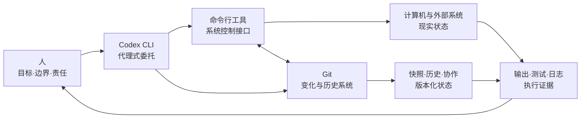

# AI 时代的工具心智模型

> 这里不是命令、菜单或参数的收藏夹，而是一组关于**接口、变化与委托**的长期知识地图。
>
> 默认前提：AI 可以完成绝大多数具体操作；人负责目标、边界、证据、风险与最终责任。

本仓库只维护可长期阅读和复用的知识文档，不作为个人主页或网站源码。文档中的产品名称、链接和易变细节会随官方资料更新；稳定的心智模型与时效性事实分开维护。

## 从这里开始

三篇文档回答三个彼此相连的问题：

| 层次 | 文档 | 核心问题 | 你会获得什么 |
|---:|---|---|---|
| 1 | [命令行工具基础](docs/command-line-tools/README.md) | 人或 AI 如何通过稳定接口观察并改变计算机状态？ | 接口、契约、组合、反馈与自动化的心智模型 |
| 2 | [Git 版本控制](docs/git-version-control/README.md) | 变化如何在时间、并行和不确定性中被保存、比较与整合？ | 状态、快照、历史、协作与恢复的心智模型 |
| 3 | [Codex CLI](docs/codex-cli/README.md) | 如何把复杂的软件工作可靠地委托给 AI 代理？ | 委托、权限、上下文、证据与责任的心智模型 |

推荐按 **命令行工具 → Git → Codex CLI** 阅读：先理解机器接口，再理解变化如何被治理，最后理解 AI 如何在这两层之上持续行动。

## 整体关系



它们不是三个孤立工具：

- **命令行工具**提供可组合、可自动化、可观察的行动接口；
- **Git**给行动产生的变化建立边界、身份、历史和协作关系；
- **Codex CLI**读取目标与上下文，调用前两者行动，并依据结果继续推理；
- **人**决定什么值得做、什么不允许发生，以及什么证据足以接受结果。

## 按问题选择入口

**“我不理解 AI 到底怎样操作计算机。”**  
从[命令行工具基础](docs/command-line-tools/README.md)开始。

**“我担心人或 AI 的修改互相覆盖、难以追踪或无法恢复。”**  
阅读[Git 版本控制](docs/git-version-control/README.md)。

**“我想让 AI 独立完成复杂任务，但又不想失去控制。”**  
阅读[Codex CLI](docs/codex-cli/README.md)。

## 共同的分析框架

每篇文档都尽量使用同一套结构，便于跨主题迁移：

1. **Essence**：它是什么，为什么存在；
2. **World Model**：它处理哪些对象、角色、状态和系统；
3. **Concept Map**：核心概念如何相互连接；
4. **Decision Map**：什么情境下应该自然想到它；
5. **Search Space**：初学者尚未意识到哪些问题；
6. **Ecosystem**：它在上下游、替代与互补系统中的位置；
7. **Transferable Principles**：哪些知识可以迁移并长期稳定；
8. **Minimum Mental Model**：只记住少数概念时应该保留什么。

## 仓库结构

```text
.
├── README.md
└── docs/
    ├── command-line-tools/
    │   └── README.md
    ├── git-version-control/
    │   └── README.md
    └── codex-cli/
        └── README.md
```

## 维护原则

- 根 README 只负责导航和解释知识之间的关系，不承载某一主题的全部正文；
- 每篇主题文档保持可独立阅读，并提供返回首页及前后篇导航；
- 稳定的心智模型与易变的工具细节分开维护；
- 新主题应先确定它在“意图—接口—变化—验证—现实结果”链条中的位置；
- 具体命令、安装步骤和故障排查应放在独立实践材料中，不让它们淹没长期知识。

## 贡献与许可

提交修订前请阅读 [CONTRIBUTING.md](CONTRIBUTING.md)。除另有说明外，本仓库的原创文档采用 [Creative Commons Attribution 4.0 International](LICENSE) 许可。
