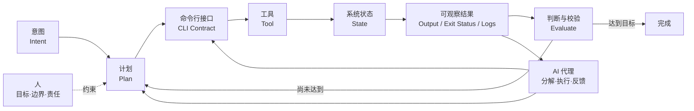
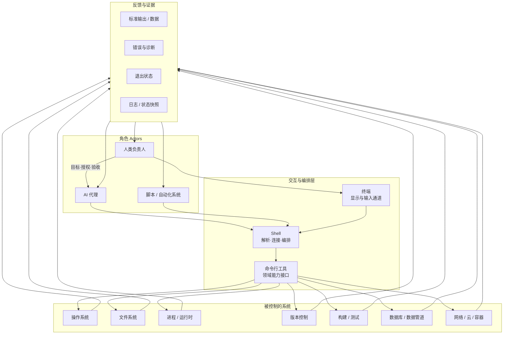
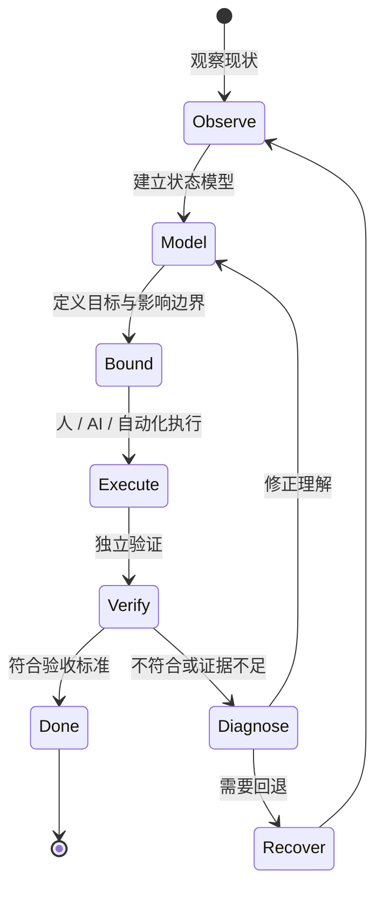
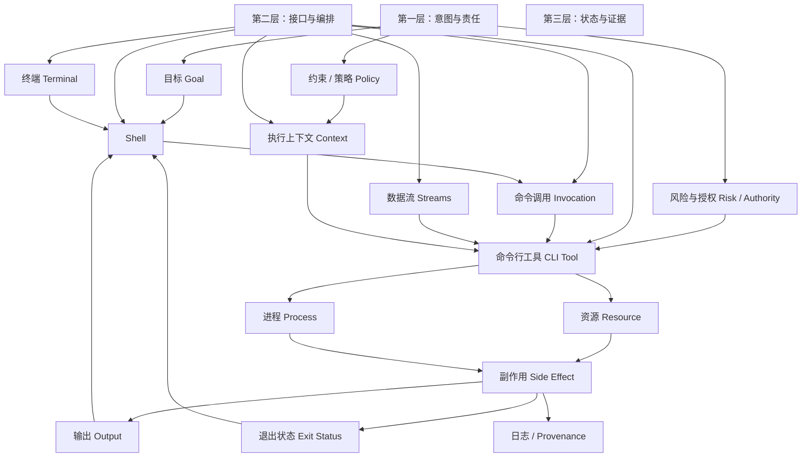
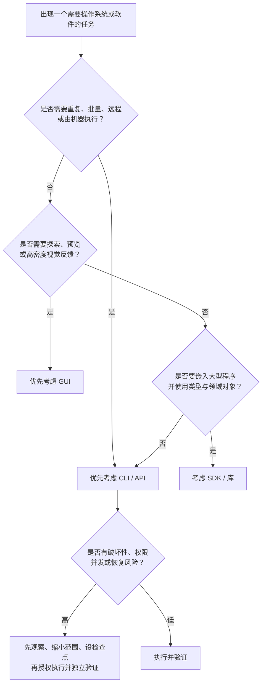
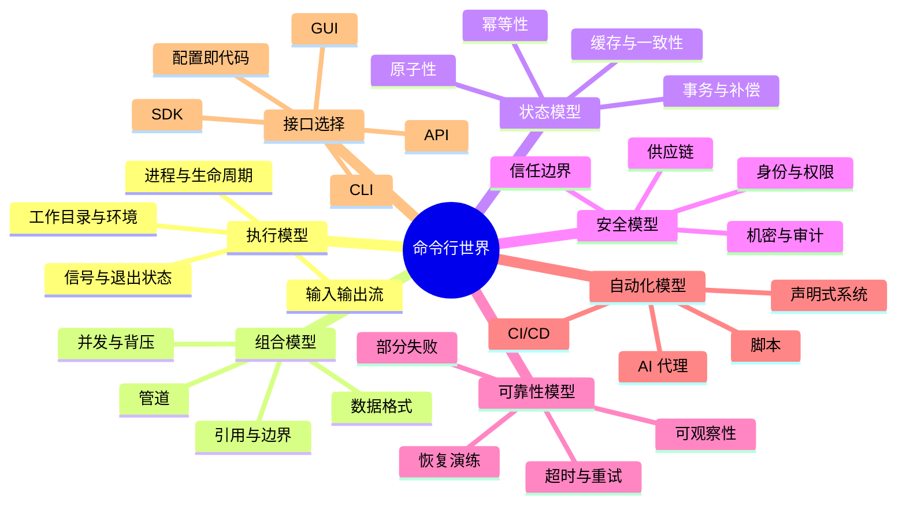
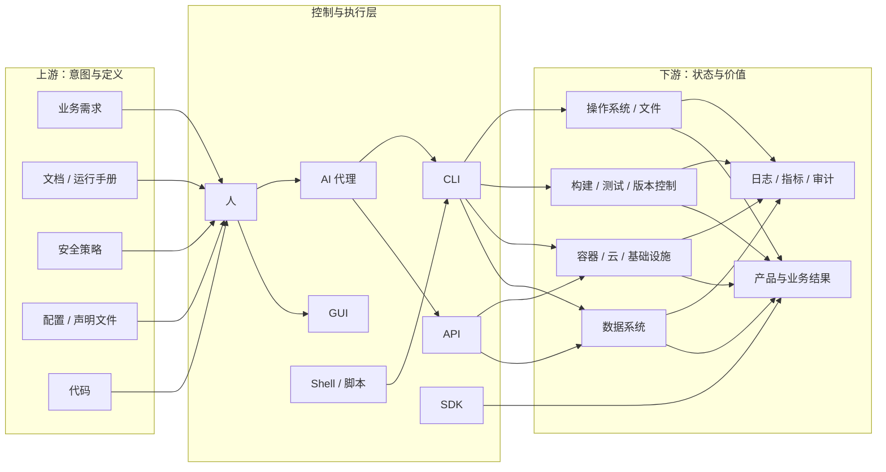

# 命令行工具基础：面向 AI 时代的心智模型

> 这不是命令手册。本文把命令行工具理解为一种**可组合、可自动化、可审计的系统控制界面**。
>
> 默认前提：AI 可以完成绝大多数具体操作；人的主要职责是定义目标、约束、风险边界和验收标准。

---

## 阅读地图



命令行工具位于“意图”和“系统状态”之间。它把人的目标或 AI 的计划，翻译成机器可执行、可观察、可重复的状态变化。

---

## 1. 本质（Essence）

### 一句话定义

**命令行工具是通过稳定、结构化的文本契约，查询或改变计算机系统状态的程序。**

这里的重点不是“黑底白字”，而是**契约**：输入是什么、会影响什么、成功如何判断、失败如何表达。

### 为什么它存在？

计算机内部有大量对象和状态：文件、进程、网络连接、代码版本、构建产物、云资源、数据库记录、权限与配置。人和其他程序都需要一种方式向系统表达：

- 我想观察什么；
- 我想改变什么；
- 允许影响哪些范围；
- 怎样证明操作成功；
- 失败后如何定位、重试或恢复。

图形界面擅长帮助人“看见并探索”；命令行接口擅长把意图变成**精确、可重复、可组合的操作描述**。这正是它长期存在的原因。

### 它解决的根本问题

根本问题不是“怎样少点几次鼠标”，而是：

> **怎样以较低的歧义和成本，让人或程序可靠地控制另一个系统，并获得机器可判断的反馈？**

命令行工具通常通过四件事回答这个问题：

1. **输入契约**：目标、参数、数据和上下文如何传入；
2. **作用边界**：它能够读取、创建、修改或删除什么；
3. **结果契约**：输出、错误和退出状态如何表示；
4. **组合能力**：一个工具的结果能否成为另一个工具的输入。

### 没有它时，人们通常怎么办？

- 在图形界面中逐次点击，依靠人的记忆保证一致性；
- 直接修改内部文件或数据库，绕过系统原本的规则；
- 编写一次性的专用程序；
- 调用网络 API 或 SDK；
- 依赖人工操作文档，把流程当作“手艺”传递。

这些方式并非错误，但在批量处理、远程控制、自动化、复现、审计和跨工具编排上，成本通常更高。

### 它带来的新可能

- 把一次操作保存为可重复的过程；
- 把多个小能力组合成新的工作流；
- 在本机、服务器、容器和持续集成环境中使用同一控制方式；
- 让人、脚本、AI 代理共享同一个操作界面；
- 用输出、退出状态和日志形成自动反馈回路；
- 把基础设施、构建、测试、部署等工作从“人工动作”提升为“可验证系统”。

### AI 时代的重新理解

过去，命令行常被理解为“人必须记住的指令语言”；现在，更有用的理解是：

> **命令行是 AI 操作计算环境的一组执行器，也是人与 AI 之间可检查的行动记录。**

AI 可以代替人记忆具体语法，但不能消除这些问题：目标是否正确、权限是否合适、影响范围是否受控、结果是否可验证、失败是否可恢复。人的价值因此从“记命令”转移到“设计边界与判断结果”。

---

## 2. 世界模型（World Model）

### 它在现实世界中的位置



### 世界模型的六个维度

| 维度 | 命令行世界中的含义 | 关键问题 |
|---|---|---|
| 对象（Objects） | 文件、目录、进程、资源、记录、包、版本、构建产物、配置 | 操作的对象究竟是什么？如何唯一识别？ |
| 角色（Actors） | 人、AI 代理、脚本、CI/CD、操作系统、远程服务 | 谁发起、谁授权、谁执行、谁承担结果？ |
| 状态（State） | 存在/不存在、运行/停止、已提交/未提交、期望/实际、成功/失败 | 当前状态是什么？目标状态是什么？变化是否可逆？ |
| 工作流（Workflow） | 观察 → 计划 → 执行 → 校验 → 恢复或继续 | 每一步的证据是什么？失败如何进入下一轮？ |
| 系统（Systems） | Shell、操作系统、文件系统、网络服务、版本控制、构建系统、权限系统 | 边界在哪里？哪个系统拥有真实状态？ |
| 价值（Value） | 精确、复现、规模化、组合、远程执行、审计、低交互成本 | 相比人工动作，确定性和反馈是否真的提高？ |

### 状态变化是核心，不是文本本身

每次操作都可以抽象成：

```text
当前状态 S₀ + 操作 f + 上下文 C → 新状态 S₁ + 证据 E
```

- `S₀`：操作前的真实状态；
- `f`：工具提供的查询或变换；
- `C`：工作目录、环境、身份、权限、配置、时间等隐含上下文；
- `S₁`：操作后的真实状态；
- `E`：输出、错误、退出状态、日志或再次查询所得的证据。

初学者往往只看 `f`（“用了什么命令”）；专业人士更关心 `S₀`、`C`、`S₁` 和 `E`。

### 被改变的工作流



它把“凭手感操作”变成一个闭环：**观察、建模、约束、执行、验证、恢复**。

---

## 3. 概念地图（Concept Map）

### 领域全图（3 层）



### 核心概念及其关系

| 名词（Entity） | 动词（Action） | 目的（Purpose） | 与其他概念的关系（Relationship） |
|---|---|---|---|
| 意图（Intent） | 描述期望 | 说明为什么行动 | 被计划细化，被策略约束，最终由证据检验 |
| 终端（Terminal） | 承载输入输出 | 提供人与会话的可见界面 | 容纳 Shell，但通常不理解领域操作 |
| Shell | 解析、展开、连接、调度 | 编排程序和数据流 | 接收命令调用，启动工具，传递环境和退出状态 |
| 命令行工具（CLI Tool） | 查询或改变状态 | 提供某个领域的可调用能力 | 由 Shell 启动，与文件、进程、服务等系统交互 |
| 命令调用（Invocation） | 实例化一次请求 | 把意图具体化为某次执行 | 由工具、参数、输入及上下文共同构成；不是工具本身 |
| 参数（Arguments） | 指定目标与策略 | 缩小操作歧义 | 属于显式输入，但不能代表全部上下文 |
| 标准输入（stdin） | 接收数据 | 把数据与调用方式解耦 | 可来自人、文件或上游工具 |
| 标准输出（stdout） | 返回主要结果 | 供人阅读或供下游消费 | 应尽可能与诊断信息分离 |
| 标准错误（stderr） | 返回诊断 | 解释异常或进度 | 不等于“必然失败”；成功与否仍看契约和退出状态 |
| 退出状态（Exit Status） | 表示执行结论 | 让机器进行条件判断 | 是自动化反馈的最小信号，但不证明业务目标一定达成 |
| 管道（Pipeline） | 连接数据流 | 组合小能力 | 将上游输出变成下游输入，形成新能力 |
| 环境（Environment） | 提供隐含配置 | 让调用适应运行位置与身份 | 包含工作目录、环境变量、区域设置、凭据等上下文 |
| 资源（Resource） | 被读取或变更 | 承载真实业务状态 | 可能位于本机，也可能属于远程系统 |
| 副作用（Side Effect） | 改变外部状态 | 实现实际结果 | 必须考虑范围、幂等性、并发和可恢复性 |
| 权限（Permission） | 允许或拒绝 | 限制能力半径 | 决定工具“能做什么”，不决定“应该做什么” |
| 可观察性（Observability） | 暴露证据 | 支持判断、诊断和审计 | 由输出、日志、状态查询和追踪共同构成 |
| 幂等性（Idempotency） | 安全地重复 | 降低重试风险 | 重复执行后状态不继续偏移，是可靠自动化的关键属性 |
| AI 代理（Agent） | 分解、选择、执行、校验 | 把高层目标转成多步行动 | 使用 CLI 作为执行器；仍受权限、上下文和验证约束 |

### 五个经常混淆的对象

```text
终端（窗口/通道）
  └─ 运行 Shell（解释与编排程序）
       └─ 发起一次命令调用（具体请求）
            └─ 启动命令行工具（领域程序）
                 └─ 访问操作系统或远程服务（真实状态所在处）
```

因此，“在终端里输入的东西”并不都是同一种语言：一部分由 Shell 解释，一部分被原样交给具体工具，工具又可能调用远程 API。

---

## 4. 决策地图（Decision Map）

专业人士通常不是因为“喜欢命令行”而想到它，而是因为问题出现了以下信号。

### 总体决策树



### 真实场景

#### 场景 A：同类操作开始重复

**Situation**：相同操作需要处理许多对象，或未来还会再次发生  
↓  
**Decision**：把任务交给命令行工具与自动化代理，以显式输入描述对象集合和规则  
↓  
**Reason**：人的点击行为难以复制、比较和审计  
↓  
**Expected Outcome**：操作一致，可复现，边际成本随规模下降

#### 场景 B：需要证明过程发生过

**Situation**：结果将被审查，需要复盘谁在何时改变了什么  
↓  
**Decision**：选择能输出结构化结果、退出状态与日志的命令行工作流  
↓  
**Reason**：可记录的调用和证据比人的操作回忆可靠  
↓  
**Expected Outcome**：形成可追溯的行动链与验收证据

#### 场景 C：需要在远程或无图形环境执行

**Situation**：目标位于服务器、容器、CI 环境或受限计算节点  
↓  
**Decision**：使用命令行接口作为远程控制面  
↓  
**Reason**：文本协议开销低，容易跨网络传递和自动调用  
↓  
**Expected Outcome**：同一意图能在不同环境中稳定执行

#### 场景 D：多个工具必须形成链路

**Situation**：数据需要经历获取、筛选、转换、验证和发布  
↓  
**Decision**：选择输入输出边界清晰、可组合的工具  
↓  
**Reason**：单个工具不必理解全局，只需履行局部契约  
↓  
**Expected Outcome**：小能力组合成可替换、可测试的工作流

#### 场景 E：AI 需要代表人操作电脑

**Situation**：目标容易描述，但具体步骤多、变化快或不值得人记忆  
↓  
**Decision**：让 AI 规划并调用 CLI，人定义范围、禁区和验收条件  
↓  
**Reason**：CLI 给 AI 提供低歧义执行器，也保留可检查记录  
↓  
**Expected Outcome**：人从操作员转为委托者、监督者和结果负责人

#### 场景 F：操作具有破坏性

**Situation**：动作可能删除数据、覆盖配置、扩大权限或影响生产环境  
↓  
**Decision**：先做只读探测，缩小目标集合，建立备份或检查点，再分阶段执行  
↓  
**Reason**：执行速度越高，错误的爆炸半径也可能越大  
↓  
**Expected Outcome**：自动化仍然高效，但风险被限制且结果可恢复

#### 场景 G：当前问题主要是视觉探索

**Situation**：需要比较图像、拖拽布局、浏览陌生对象或依赖空间感知  
↓  
**Decision**：先使用图形界面探索，再在重复和固化阶段引入 CLI  
↓  
**Reason**：视觉界面擅长发现与直接操纵，CLI 擅长表达已明确的意图  
↓  
**Expected Outcome**：探索效率与自动化能力兼得

#### 场景 H：需要稳定的软件集成

**Situation**：能力要嵌入长期运行的大型应用，并需要强类型、细粒度错误处理或高吞吐  
↓  
**Decision**：评估 API 或 SDK 是否比 CLI 更合适；CLI 可保留为运维和调试入口  
↓  
**Reason**：进程边界和文本解析并不总是最佳集成方式  
↓  
**Expected Outcome**：选择与生命周期、性能和可靠性要求匹配的接口

### 什么时候不该首先想到命令行？

- 任务以视觉探索、空间布局或连续交互为核心；
- 只有一次、风险低，且固化流程的成本高于收益；
- 目标系统没有稳定 CLI 契约，而 API/SDK 更可靠；
- 操作者无法看到影响范围，且系统缺少预览、回滚或验证机制；
- 需要业务人员直接理解并控制流程，而文本接口会提高协作门槛。

---

## 5. 搜索空间扩展（Search Space Expansion）

学习上限不取决于记住多少命令，而取决于能否提出正确的问题。

### 第一圈：初学者通常不会想到的问题

#### 关于上下文

- 同一个调用在不同工作目录、用户身份、环境变量和区域设置下会不会得到不同结果？
- 工具读取了哪些没有显式写出的配置？配置优先级是什么？
- 名称指向的是当前对象、缓存副本，还是远程系统中的对象？

#### 关于结果

- “没有报错”是否真的等于业务目标达成？
- 输出是给人看的文本，还是有稳定模式的机器数据？
- 是否存在部分成功、警告成功、异步接受但尚未完成？

#### 关于影响范围

- 操作改变的是单个对象、一类对象，还是隐含关联对象？
- 通配、递归、默认目标和继承规则会不会扩大范围？
- 修改发生在本地、远程、缓存、控制平面还是数据平面？

#### 关于时间

- 状态在观察与执行之间是否可能变化？
- 重试会不会造成重复副作用？
- 操作完成的含义是“请求已接收”，还是“系统已达到稳定状态”？

### 第二圈：专家真正关心的问题

| 关注面 | 专家问题 | 它为什么重要 |
|---|---|---|
| 契约稳定性 | 输入、输出和退出语义是否有版本保证？ | 决定自动化能否长期可靠运行 |
| 幂等性 | 同一意图重复执行是否安全？ | 决定失败后能否直接重试 |
| 原子性 | 操作是全成或全败，还是可能部分完成？ | 决定恢复与补偿策略 |
| 并发 | 别的参与者同时修改状态会发生什么？ | 防止覆盖、竞态和陈旧判断 |
| 可观察性 | 能否区分计划、执行、接受、完成和生效？ | 防止把表面成功误判为真实成功 |
| 爆炸半径 | 最坏情况下会影响多少对象或用户？ | 决定授权、分批和隔离方式 |
| 权限模型 | 能力能否按最小权限授予并及时撤销？ | 限制代理或凭据被滥用的后果 |
| 可恢复性 | 有回滚、快照、补偿或重建路径吗？ | 决定错误是否可承受 |
| 可移植性 | 对操作系统、Shell、版本和编码有哪些假设？ | 决定工作流能否跨环境运行 |
| 供应链 | 工具本身、插件和下载内容是否可信？ | 工具也是可执行的攻击面 |
| 非交互性 | 是否依赖提示、分页器、图形窗口或人工确认？ | 决定 AI 和 CI 能否稳定控制 |
| 机密处理 | 凭据会不会进入参数、历史、日志或进程列表？ | 决定信息泄露风险 |

### 第三圈：下一步值得探索的领域



### 决定领域上限的问题

这些问题比“会不会使用某个工具”更决定能力上限：

1. **如何把模糊目标变成可验证的状态断言？**
2. **如何区分控制平面的成功与现实结果的成功？**
3. **如何设计可重复执行、可中断、可恢复的工作流？**
4. **如何让机器输出既稳定可解析，又保留足够的诊断信息？**
5. **如何在速度、权限、可观察性和爆炸半径之间做权衡？**
6. **如何验证 AI 的行动，而不是仅相信它对行动的描述？**
7. **如何把一次性操作升级为可维护的系统，而不制造脆弱自动化？**
8. **当状态由多个系统共同拥有时，谁是事实来源（source of truth）？**
9. **什么时候应使用命令式操作，什么时候应声明期望状态并让控制器收敛？**
10. **怎样保存决策依据、输入版本和执行证据，使结果可以复现？**

### 一条推荐的探索路径

不是从语法开始，而是依次理解：

```text
对象与状态
  → 进程、上下文与权限
    → 输入输出与结果契约
      → 组合、幂等与失败语义
        → 可观察性、恢复与审计
          → 自动化系统与 AI 代理
```

---

## 6. 生态系统（Ecosystem）

### 系统位置图



### 上游（Upstream）

命令行调用之前，通常已有：

- **目标与需求**：定义希望出现的现实结果；
- **领域模型**：定义对象、关系和合法状态；
- **策略与权限**：定义允许谁在何种范围内行动；
- **配置与代码**：表达期望状态或实现逻辑；
- **人或 AI 的计划**：把目标分解为可执行步骤。

上游质量决定 CLI 是否只是“高速执行错误意图”。

### 下游（Downstream）

命令行工具往往影响：

- 文件、进程与操作系统资源；
- 代码仓库、依赖、构建、测试和发布；
- 容器、云基础设施和远程服务；
- 数据库、消息系统和数据管道；
- 日志、指标、审计记录与最终业务结果。

下游越关键，越需要独立验证、最小权限、分阶段执行和恢复路径。

### 替代方案（Alternatives）

| 方案 | 最擅长 | 相比 CLI 的主要权衡 |
|---|---|---|
| GUI | 发现、浏览、预览、空间操作、低门槛交互 | 自动化、复现、批量和远程能力通常较弱 |
| Web API | 跨网络的稳定程序集成 | 认证、协议、分页、限流和状态管理更显式 |
| SDK / 库 | 应用内集成、类型系统、高吞吐、细粒度控制 | 与语言和运行时绑定更深 |
| 直接编辑配置 | 表达期望状态，便于版本管理 | 是否生效仍依赖解释器或控制器 |
| 数据库/内部接口 | 直接、强大 | 容易绕过业务规则，耦合与风险更高 |
| 人工流程 | 适应模糊例外，能运用情境判断 | 难以规模化、复现和审计 |

CLI、GUI、API 和 SDK 不是成熟度阶梯，而是不同的**交互边界选择**。同一系统通常会同时提供几种入口。

### 互补方案（Complements）

- **Shell 与脚本语言**：把单次调用组织成控制流；
- **版本控制**：保存代码、配置与决策历史；
- **测试与断言**：把“看起来成功”升级为可验证结果；
- **容器与虚拟环境**：隔离依赖和执行上下文；
- **配置管理与基础设施即代码**：声明期望状态并持续收敛；
- **可观察性系统**：提供日志、指标、追踪和告警；
- **密钥管理**：避免凭据散落在参数、历史和日志中；
- **任务运行器与 CI/CD**：提供调度、审批、并发控制和记录；
- **AI 代理**：把自然语言意图映射为工具选择、执行和反馈循环；
- **沙箱与权限系统**：限制自动执行的能力范围。

### 命令式与声明式

这是生态中非常重要的一条轴：

- **命令式**：告诉系统“下一步做什么”；适合探索、诊断和精确过程控制。
- **声明式**：告诉系统“最终应该是什么状态”；适合持续维护、漂移修复和规模化治理。

CLI 可以承载两者。成熟工作流常用命令式工具探索问题，再把稳定认识沉淀为声明式配置或自动化控制器。

---

## 7. 可迁移原则（Transferable Principles）

### 第一性原理

1. **工具是状态变换器**：评价工具应看它如何把 `S₀` 变成 `S₁`，而不是界面长什么样。
2. **接口是一份契约**：可靠性来自明确的输入、输出、副作用和失败语义。
3. **上下文也是输入**：未写在调用中的目录、身份、权限、配置和时间仍会影响结果。
4. **执行不等于达成目标**：退出成功只是证据之一，业务结果需要独立验证。
5. **组合依赖边界**：小工具之所以能组合，是因为它们对数据和责任边界有约定。
6. **能力越强，风险半径越大**：自动化提高速度，也会放大错误；权限与验证必须同步升级。
7. **真实状态拥有最终解释权**：日志和描述是证据，不是现实本身。

### 可迁移的方法论

无论操作文件、代码、云资源还是数据，都可以使用同一套思考框架：

1. 定义期望结果，而不是先指定动作；
2. 找出事实来源和当前状态；
3. 显式列出假设、上下文和权限；
4. 缩小目标集合与爆炸半径；
5. 优先只读探测或预览；
6. 设计幂等、可中断、可恢复的步骤；
7. 执行后用独立信号验证；
8. 保存足以复现和审计的证据；
9. 把反复出现的操作沉淀为更高层抽象。

### 当前实现细节

这些内容有用，但不应被误当作本质：

- 某个 Shell 的具体语法与引用规则；
- 某个操作系统的路径格式和命令名称；
- 某个工具的参数拼写、默认值和输出文本；
- 终端配色、快捷键、提示符与补全方式；
- 某个版本的配置位置或认证流程。

AI 很适合承担这些检索和适配工作。

### 长期稳定的知识

- 进程、输入、输出、退出状态和副作用；
- 当前状态、期望状态与状态转换；
- 权限、身份、信任边界和最小授权；
- 幂等性、原子性、并发、超时、重试和恢复；
- 接口契约、组合、可观察性和验证；
- GUI、CLI、API、SDK 之间的边界选择；
- 人负责意图与责任，代理负责可检查的执行。

### 容易变化的知识

- 工具版本、参数、默认行为和输出格式；
- 软件安装、分发和更新方式；
- 平台限制、云服务能力和认证机制；
- AI 代理能调用的工具、权限与可靠程度；
- “最佳实践”中依赖当前生态或安全形势的部分。

维护本文时，应优先更新易变知识的边界与风险，不必把它扩写成命令百科。

---

## 8. 最小心智模型（Minimum Mental Model）

如果只能记住 15 个概念，按重要性排序如下：

| 排名 | 概念 | 为什么重要 |
|---:|---|---|
| 1 | 状态（State） | 所有操作最终都在读取或改变状态；这是理解工具的起点 |
| 2 | 意图与验收标准（Intent & Acceptance） | 防止把“执行了动作”误当成“完成了目标” |
| 3 | 作用范围 / 爆炸半径（Scope / Blast Radius） | 决定一次错误最多会伤害什么 |
| 4 | 上下文（Context） | 解释为什么相同调用在不同地点、身份或时间产生不同结果 |
| 5 | 工具契约（Contract） | 说明输入、输出、副作用和失败分别意味着什么 |
| 6 | 观察—执行—验证闭环 | 让操作从一次猜测变为可纠正过程 |
| 7 | 权限与身份（Authority & Identity） | 区分“有能力做”与“被允许做”，限制风险 |
| 8 | 副作用与可逆性（Side Effect & Reversibility） | 决定执行前需要多少检查、备份与审批 |
| 9 | 幂等性（Idempotency） | 决定操作能否安全重试，是自动化可靠性的核心 |
| 10 | 输出、错误与退出状态 | 构成机器可判断的最小反馈面 |
| 11 | Shell、终端与 CLI 的边界 | 避免把显示界面、编排器和领域工具混为一谈 |
| 12 | 组合（Composition） | 解释小工具如何构成复杂工作流 |
| 13 | 事实来源（Source of Truth） | 决定发生冲突时应该相信哪个系统 |
| 14 | 部分失败与恢复（Partial Failure & Recovery） | 现实操作不总是全成或全败，必须设计后续路径 |
| 15 | AI 代理的责任边界 | AI 可负责步骤，但目标、授权和结果责任不能自动消失 |

可把它压缩成一句检查语：

> **谁，基于什么上下文，要把哪些对象从什么状态变成什么状态；影响边界多大，凭什么判断成功，失败后如何恢复？**

---

## 9. 常见误区（Common Misconceptions）

| 误解 | 为什么会产生 | 更准确的心智模型 |
|---|---|---|
| 命令行就是黑色窗口 | 最先看到的是终端外观 | 终端只是通道；Shell 负责编排；CLI 工具提供领域能力 |
| 学会命令行就是背命令 | 传统教程按语法和命令组织 | 核心能力是理解对象、状态、边界、契约和验证；语法可查、可交给 AI |
| CLI 比 GUI 更“高级” | CLI 看起来更技术化 | 它们优化不同任务：GUI 偏探索，CLI 偏复现、组合与自动化 |
| 命令是对计算机的完整描述 | 调用文本最显眼 | 结果还取决于目录、环境、身份、配置、版本、网络和时间 |
| 没有错误信息就是成功 | 人倾向把沉默当作确认 | 退出状态只是初步信号，真实目标应由独立状态或业务断言验证 |
| 输出就是事实 | 输出看起来权威且精确 | 输出是某个工具在某一时刻提供的观察，可能陈旧、截断或只代表控制面 |
| 自动化一定更可靠 | 自动化减少了手工差异 | 设计良好的自动化更可靠；脆弱自动化只会更快、更一致地犯错 |
| 重复执行同一操作一定安全 | 文本相同给人“行为相同”的错觉 | 是否安全取决于幂等性、当前状态、时间和外部副作用 |
| 管道只是省去临时文件 | 表面上只是数据传递 | 管道建立了生产者—消费者契约，也引入错误传播、缓冲和部分失败问题 |
| 权限足够就可以执行 | 操作系统只判断“能不能” | 权限不包含业务授权、风险判断和伦理责任 |
| AI 会命令行，所以不需要人理解 | AI 能快速生成并执行具体步骤 | 人更需要理解状态、影响范围、授权和验收，才能正确委托与监督 |
| AI 的解释等于执行证据 | 自然语言总结流畅可信 | 应检查真实输出、状态差异、测试、日志或独立查询 |
| CLI 天然可移植 | 文本看起来跨平台 | Shell 语义、路径、编码、工具版本和默认行为都可能不同 |
| 所有问题最终都该写成脚本 | 可自动化容易被等同于值得自动化 | 频率、风险、变化率和维护成本共同决定是否固化 |
| 工具越强越好 | 更多权限和功能带来即时便利 | 专用、最小权限、边界清晰的工具更容易预测、验证和治理 |

---

## 10. 总结（Summary）

命令行工具的真正价值，不是让人以另一种方式点击按钮，而是把计算机操作转化为：

- 可表达的意图；
- 有边界的状态变化；
- 可组合的执行单元；
- 可由机器判断的反馈；
- 可复现、可审计、可恢复的工作流。

当 AI 负责具体操作时，人的核心问题从“应该输入什么”变为：

1. 我真正想改变的状态是什么？
2. 哪些对象和系统在范围内，哪些绝不能碰？
3. AI 基于哪些假设和权限行动？
4. 什么证据足以证明目标达成？
5. 如果只完成一部分、重复执行或中途失败，如何恢复？

> **我真正获得的不是一套需要背诵的命令，而是一种把意图转化为可控、可验证系统变化的思维方式。**

---

## 文档维护原则

- 保持本文以 Why、关系、状态和决策为中心，不扩展成语法手册；
- 新增概念时，说明它处理什么对象、改变什么状态、与哪些概念相连；
- 新增工具时，优先把它放入生态位置，而不是罗列功能；
- 对易变内容注明适用平台、版本和时间；
- 把具体命令、安装和故障排查放入独立的实践文档；
- 定期检查 Mermaid 图与表格是否仍能表达一致的世界模型。

