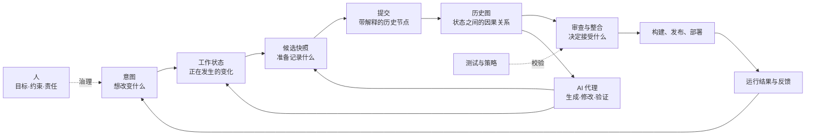
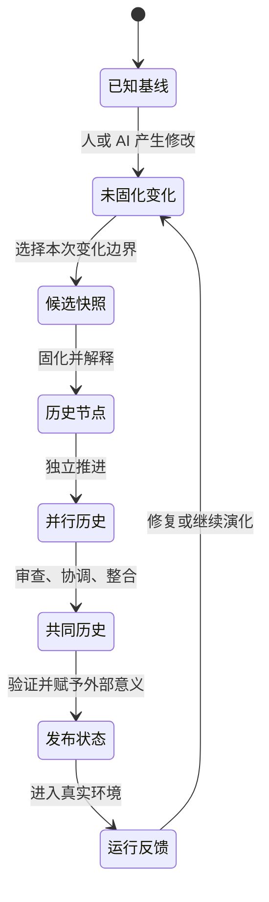
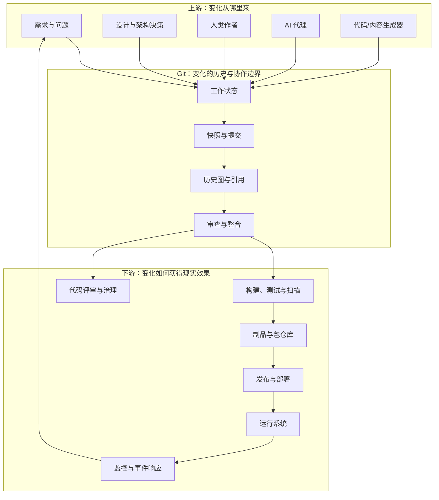
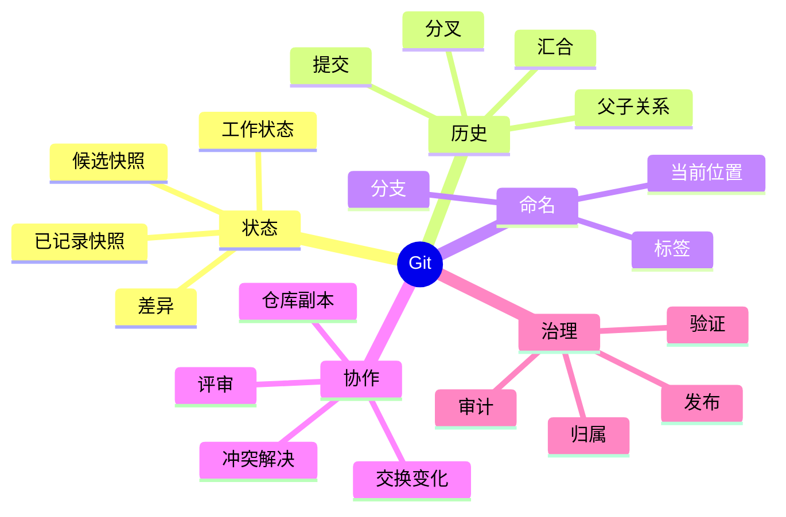
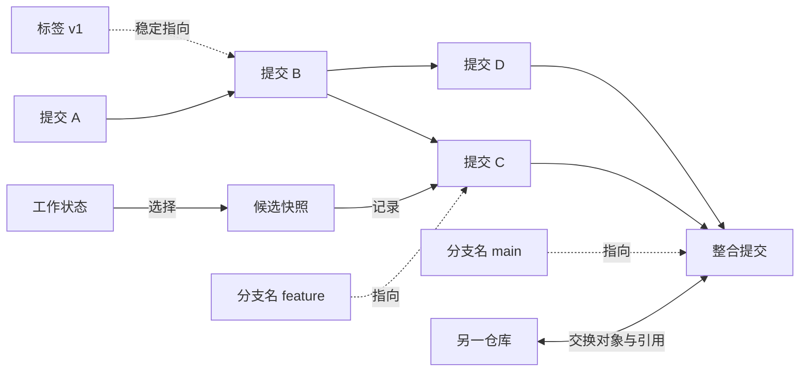
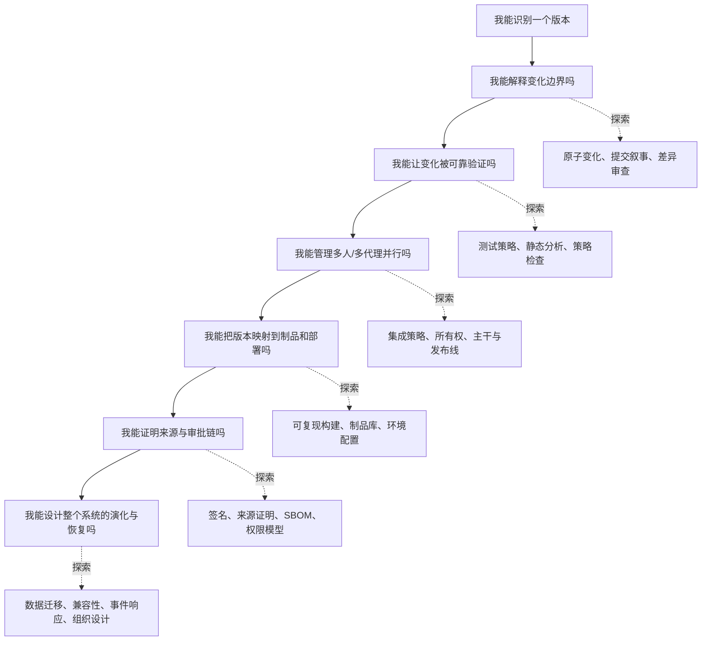
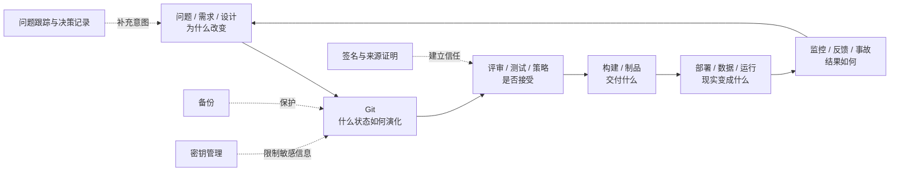
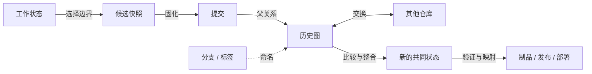
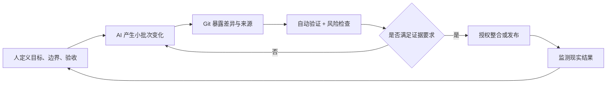

# Git 版本控制：面向 AI 时代的心智模型

> 这不是 Git 操作手册。
>
> 本文默认 AI 可以完成绝大多数具体操作；人的核心职责是定义意图、边界、风险与验收标准。
> 目标是理解 Git 为什么存在、何时值得想到它，以及它如何改变个人与团队对“变化”的管理。

---

## 阅读地图

Git 位于“产生变化”和“接受变化”之间。它不替人判断变化是否正确，而是让变化变得**可命名、可比较、可追溯、可并行、可整合、可撤销**。

---

## 1. 本质（Essence）

### 一句话定义

**Git 是一个以不可变快照及其因果关系为核心、用可移动名称组织历史、并允许多方独立复制与整合的分布式版本数据库。**

“版本控制”只是它的表面用途。更深一层看，Git 管理的是三个问题：

1. 某个时刻，系统的内容究竟是什么？
2. 这个状态从哪些先前状态演化而来？
3. 多个参与者各自改变世界后，如何判断、交换并整合这些变化？

### 为什么它存在？

软件和文档不是一次写成的成品，而是一连串带有不确定性的决策。变化会失败、需求会反转、多人会并行工作、发布状态需要被重现，几个月后还可能有人追问“为什么当时这样改”。

如果只保存“最新版”，我们就丢失了决策过程；如果只保存一堆副本，我们知道有差异，却不知道差异之间的因果关系。Git 的存在，是为了把变化从一种容易消失的临时行为，变成可以推理和协作的持久对象。

### 它解决的根本问题

根本问题不是“文件保存”，而是：

> **在时间、并行和不确定性同时存在时，如何保留可信的系统状态与演化关系，并以可控成本整合变化。**

这个问题可以拆成六个张力：

| 张力 | 没有版本控制时的风险 | Git 提供的认知能力 |
|---|---|---|
| 变化 vs. 稳定 | 新尝试破坏已有成果 | 把稳定基线与实验变化分开 |
| 现在 vs. 过去 | 旧状态被覆盖 | 保留一条可查询的演化路径 |
| 个人 vs. 团队 | 相互覆盖、来源不明 | 明确每组变化的来源和关系 |
| 并行 vs. 一致 | 多条工作线难以汇合 | 显式建立分叉与汇合关系 |
| 速度 vs. 审查 | 快速修改绕过判断 | 先把变化封装，再决定是否接受 |
| 自动化 vs. 责任 | AI 大量产出但难以核验 | 形成小而可审查、可回退的证据单元 |

### 没有它时，人们通常怎么办？

- 复制目录，命名为“最终版”“最终版2”“真的最终版”。
- 依赖时间戳、聊天记录、邮件附件或个人记忆解释变化。
- 让所有人轮流编辑一个共享副本，降低并行度以避免冲突。
- 用备份恢复整个目录，却很难只撤销某个逻辑变化。
- 出问题后比较多个文件副本，人工猜测变化来源。
- 用流程限制实验，因为试错的恢复成本太高。

这些方法不是完全无效；它们缺少的是一个统一模型：**状态是什么、状态如何连接、名字指向哪里、变化由谁提出、何时被团队接受。**

### 它带来的新可能

- **低成本实验**：尝试不必立即污染稳定状态。
- **并行工作**：多人或多个 AI 代理可以从共同基线分叉，再显式整合。
- **可审查变化**：讨论对象从“整个项目”缩小为“这一组变化”。
- **可复现交付**：发布物可以对应到一个明确历史状态。
- **因果调查**：故障调查可以围绕“哪次状态转换引入了问题”展开。
- **自动化治理**：测试、审批、安全扫描和发布策略可以绑定到变化边界。
- **组织记忆**：历史不仅保存内容，也保存部分决策上下文与责任链。

Git 因而改变的不是“保存文件的方法”，而是**组织如何承担变化风险**。

---

## 2. 世界模型（World Model）

### 2.1 Git 处理哪些对象（Objects）

| 对象 | 它代表什么 | 关键关系 |
|---|---|---|
| 工作状态（Working State） | 此刻正在被人或 AI 修改、尚未固化的内容 | 与某个已知快照比较，产生差异 |
| 快照（Snapshot） | 某一时刻被纳入管理的完整项目状态 | 是提交的内容核心；概念上不是“修改指令清单” |
| 提交（Commit） | 快照、父节点、作者信息和说明组成的历史节点 | 指向父提交，由此形成历史图 |
| 历史图（History DAG） | 提交之间的有向无环关系 | 分叉表示并行演化，汇合表示历史整合 |
| 引用（Reference） | 指向某个提交的可移动名字 | 分支、标签以及当前所处位置都依赖引用概念 |
| 分支（Branch） | 一条演化线当前末端的可移动名字 | 它不是提交的容器；提交先形成图，分支只是指针 |
| 标签（Tag） | 为重要历史节点提供较稳定的名字 | 常用于标识发布、里程碑或外部承诺 |
| 差异（Diff） | 两个状态之间的可观察变化 | 用于理解、审查和验证，不等于状态本身 |
| 远端仓库（Remote Repository） | 另一个可独立演化的仓库副本 | 双方交换对象与引用；不存在天然唯一的“真正仓库” |
| 冲突（Conflict） | 自动整合无法确定意图的区域 | 它是决策需求，不只是文本故障 |

底层对象通常由内容派生出的标识来寻址。这带来一个重要性质：内容不变，身份稳定；内容改变，身份随之改变。但“内容身份”不等于“业务含义正确”。

### 2.2 涉及哪些角色（Actors）

| 角色 | 主要责任 | Git 能提供什么 | Git 不能替代什么 |
|---|---|---|---|
| 变更作者 | 提出一组有意图的变化 | 隔离、记录和解释变化 | 判断需求是否值得实现 |
| AI 代理 | 生成、修改、重构和验证内容 | 可恢复基线、变化边界、审计线索 | 对目标、风险和后果承担最终责任 |
| 审查者 | 判断变化是否可接受 | 聚焦差异、查看来源与上下文 | 深层领域判断与责任确认 |
| 整合者 | 决定不同工作线如何进入共同历史 | 显式汇合和冲突暴露 | 解决相互矛盾的业务意图 |
| 发布负责人 | 将历史状态映射为对外版本 | 稳定标识和可追溯来源 | 运行环境安全与发布决策 |
| 自动化系统 | 构建、测试、扫描、发布 | 稳定触发点与可重现输入 | 证明测试没有覆盖的属性 |
| 托管平台 | 协调权限、评审和协作 | 共享可见性与治理界面 | 取代 Git 的本地历史模型 |
| 使用者与运营者 | 反馈真实效果和故障 | 把运行事件追溯到版本 | 捕获全部现实世界状态 |

### 2.3 Git 管理哪些状态变化（State）

Git 最擅长管理的是**离散、可记录的内容状态**。它不会自动管理所有现实状态，例如：

- 数据库中已经发生的数据变化；
- 外部服务当前的配置与可用性；
- 密钥、权限和人员授权；
- 构建环境中未被声明的依赖；
- 用户已经感受到的业务后果。

因此，“仓库可以回到过去”不等于“整个世界可以回到过去”。

### 2.4 它改变哪些工作流（Workflow）

在 Git 之前，常见工作流是：**直接改共享成果 → 尽量不要冲突 → 出错后找副本**。

在 Git 模型中，工作流变成：

**从已知基线出发 → 隔离变化 → 固化可解释状态 → 比较与验证 → 整合历史 → 将明确状态交给下游。**

这使团队的关注点发生迁移：

| 从 | 转向 |
|---|---|
| 谁最后保存了文件 | 哪个变化基于什么状态、为何产生 |
| 如何避免所有冲突 | 如何尽早暴露并解决真实意图冲突 |
| 是否敢于尝试 | 实验的隔离边界和失败成本是什么 |
| 记住发生过什么 | 让历史本身成为可查询证据 |
| AI 是否能快速生成 | AI 的变化是否小、可验、可归因、可撤销 |

### 2.5 它与哪些系统交互（Systems）

### 2.6 它创造什么价值（Value）

Git 的价值不是“历史越多越好”，而是降低四类成本：

- **认知成本**：把大问题切成有边界的变化单元。
- **协调成本**：允许异步、并行工作，再在清晰节点上整合。
- **失败成本**：保留基线，让实验和恢复更安全。
- **证据成本**：让来源、状态和决策过程更容易被追踪。

它同时提高三种杠杆：实验速度、自动化程度、组织记忆。但历史混乱、变化过大或缺少解释时，这些价值会显著下降。

---

## 3. 概念地图（Concept Map）

### 3.1 两到三层领域地图

### 3.2 关键概念的“名词—动词—目的—关系”

| 名词（Entity） | 动词（Action） | 目的（Purpose） | 与其他概念的关系（Relationship） |
|---|---|---|---|
| 仓库 | 保存、复制、交换 | 提供项目历史的自治边界 | 包含对象和引用；远端也是仓库，不是天然中心 |
| 工作状态 | 编辑、生成、删除 | 承载尚在形成中的想法 | 相对某个快照产生差异，尚不等于历史 |
| 候选快照 | 选择、组织 | 定义“这一次准备记录什么” | 位于工作状态与提交之间，是变化边界 |
| 快照 | 记录、比较、恢复 | 给完整状态一个稳定身份 | 被提交引用；两个快照之间可计算差异 |
| 提交 | 固化、解释、连接 | 形成可追溯的演化节点 | 指向快照与父提交；多个提交组成历史图 |
| 父节点 | 连接、追溯 | 表达“从哪里演化而来” | 一个父节点通常表示延续，多个父节点通常表示汇合 |
| 历史图 | 分叉、汇合、遍历 | 表达因果与并行关系 | 是提交的网络；分支只给其中节点命名 |
| 引用 | 指向、移动 | 用人能理解的名字定位提交 | 分支和标签是不同用途的引用 |
| 分支 | 推进、分叉、整合 | 表示某条工作线当前到哪里 | 是可移动指针，不是装提交的文件夹 |
| 标签 | 标记、发布 | 给重要节点一个稳定语义名称 | 将历史身份映射为版本或里程碑 |
| 差异 | 比较、审查 | 看见两个状态之间发生了什么 | 是状态之间的投影；不能完整表达意图 |
| 合并 | 比较、协调、连接 | 把并行历史纳入共同历史 | 依赖共同祖先；结果本身成为新历史节点 |
| 冲突 | 暴露、判断、解决 | 要求人明确自动化无法确定的意图 | 可能是文本冲突，也可能是未被 Git 发现的语义冲突 |
| 远端 | 复制、获取、发布 | 让自治仓库交换历史与约定 | “远端分支”是对另一仓库状态的本地认知，不是实时共享内存 |
| 发布版本 | 构建、验证、交付 | 把内部历史状态变成外部承诺 | 通常关联标签、制品、配置与部署记录 |

### 3.3 最关键的关系图

读图时记住：

- 提交构成历史；分支只是给历史中的某个位置命名。
- 差异是两个状态的比较结果；提交不是“一份差异文件”。
- 合并不是把两个文件夹混在一起，而是承认两条历史都发生过，并创建新的共同后继。
- 远端不是云端魔法，而是另一个可以拥有不同状态和不同规则的仓库。

---

## 4. 决策地图（Decision Map）

这里不从“Git 有哪些功能”出发，而从专业人士何时会自然想到版本控制出发。

### 场景 A：准备进行高风险修改

**Situation**：一项重构可能影响许多区域，结果不确定。  
↓  
**Decision**：先建立明确基线，让实验在独立工作线上发生，并定义验证条件。  
↓  
**Reason**：风险来自未知后果；隔离和可比较性可以降低失败成本。  
↓  
**Expected Outcome**：可以大胆实验，失败时放弃该演化线，成功时再经过审查整合。

### 场景 B：人和多个 AI 代理并行修改

**Situation**：不同参与者同时处理功能、修复和文档。  
↓  
**Decision**：让每项意图拥有独立变化边界，从共同基线出发，并尽早同步依赖。  
↓  
**Reason**：并行本身不是问题；不可见的依赖和长时间分叉才会放大整合成本。  
↓  
**Expected Outcome**：产出可分别审查、归因和接受，冲突更早暴露。

### 场景 C：需要判断“这次变化是否值得接受”

**Situation**：AI 很快生成了大量看似合理的修改。  
↓  
**Decision**：把产出缩小为意图单一的变化单元，比较前后状态，并绑定自动验证与人工判断。  
↓  
**Reason**：生成速度会扩大审查瓶颈；可验证性比产出量更重要。  
↓  
**Expected Outcome**：审查者能理解变化范围、失败方式与回退边界，而不是盲目接受结果。

### 场景 D：线上出现回归

**Situation**：此前正常的行为在某个时间后失效。  
↓  
**Decision**：把问题转化为历史中的边界搜索：最后已知正常状态与最早已知异常状态之间发生了什么。  
↓  
**Reason**：历史图把无限猜测缩小为有限候选状态转换。  
↓  
**Expected Outcome**：更快定位引入问题的变化，并理解其原始意图与影响范围。

### 场景 E：必须交付一个可重现版本

**Situation**：客户、生产环境或审计方需要知道“究竟交付了什么”。  
↓  
**Decision**：把发布承诺绑定到不可歧义的历史节点，并关联构建产物、依赖和环境记录。  
↓  
**Reason**：分支名会移动，“最新版”没有长期身份；而运行结果又不只由源码决定。  
↓  
**Expected Outcome**：可以追溯源码来源、重建产物、比较版本并解释差异。

### 场景 F：需要紧急修复旧版本

**Situation**：当前开发已经向前推进，但仍需维护过去发布的版本。  
↓  
**Decision**：从对应发布状态建立维护线，只引入必要修复，再决定是否将修复传播到其他演化线。  
↓  
**Reason**：生产版本与最新开发状态属于不同现实，强行同步会带入无关风险。  
↓  
**Expected Outcome**：以最小变化修复目标版本，同时保留清晰的传播路径。

### 场景 G：团队对实现方向存在分歧

**Situation**：两种设计都可能成立，单靠讨论难以判断。  
↓  
**Decision**：让两种假设短期独立演化，用共同验收标准比较，再选择或整合。  
↓  
**Reason**：版本化实验把抽象争论变成可观察证据。  
↓  
**Expected Outcome**：决策建立在实现成本、性能与维护性证据上，未采用方案仍可保留为知识。

### 场景 H：需要撤销已经共享的错误变化

**Situation**：错误状态已经成为团队共同历史或进入下游。  
↓  
**Decision**：优先创建一个抵消其效果的新变化，而不是假装原历史从未发生。  
↓  
**Reason**：共享历史是协作契约；重写它会让其他副本对世界产生不同认识。  
↓  
**Expected Outcome**：所有参与者看到一致的因果链：错误发生过，随后被明确纠正。

### 场景 I：准备修改数据库、基础设施或外部接口

**Situation**：源码可以回退，但数据格式或外部消费者可能已经前进。  
↓  
**Decision**：把 Git 版本与迁移策略、兼容窗口、部署顺序和恢复计划共同设计。  
↓  
**Reason**：Git 只恢复被记录的内容，不能自动逆转现实世界的副作用。  
↓  
**Expected Outcome**：代码、数据与运行环境的演化保持兼容，回退不再是假安全。

### 场景 J：仓库中出现密钥或敏感数据

**Situation**：敏感信息曾被记录，即使当前状态已删除。  
↓  
**Decision**：首先撤销或轮换凭证，再评估历史净化、下游副本与缓存传播。  
↓  
**Reason**：删除当前文件不会删除所有历史对象，也不会取消已经泄露的秘密。  
↓  
**Expected Outcome**：先消除现实权限风险，再处理历史和传播面的清理。

---

## 5. 搜索空间扩展（Search Space Expansion）

初学者常把搜索空间限制在“怎样保存和恢复文件”。专家考虑的是：**变化的边界、历史的可信度、整合成本、系统可复现性，以及谁有权让变化成为现实。**

### 5.1 初学者通常不会想到的问题

#### 关于状态

- 哪些内容属于项目状态，哪些只是本地环境或生成结果？
- 同一份源码是否一定能产生同一份制品？编译器、依赖、配置和时间是否也被约束？
- 大型二进制、数据集、模型权重适合进入同一种历史系统吗？
- 文件名改变时，我们关心的是路径身份、内容身份，还是业务实体身份？

#### 关于变化边界

- 一次提交应该表达一个意图，还是一次工作时段？
- 机械格式化与业务逻辑变化混在一起，会怎样影响审查和追责？
- 如果一个变化无法独立验证，它是否真的具有清晰边界？
- 多个 AI 代理如何避免同时修改同一隐含约束？

#### 关于历史

- 历史是操作日志、证据链、协作接口，还是叙事？不同用途会不会冲突？
- 哪些历史已经被共享，因而不应随意重写？
- “作者是谁”“谁批准”“谁部署”是三个不同问题吗？
- 内容寻址能证明内容未变，但谁能证明内容来源可信？

#### 关于恢复

- 想恢复的是源码、部署状态、数据库状态，还是用户体验？
- 一个版本在未来还能构建吗，还是只能看到当时的源码？
- 删除、撤销、回退和重写历史分别改变了什么事实？
- 本地仍有未记录变化时，恢复动作可能损失什么？

#### 关于安全

- 敏感信息一旦进入历史，会传播到多少副本、缓存、日志和制品？
- 自动化身份拥有哪些写入、批准和发布权限？
- 依赖来源、构建过程和发布制品能否与历史节点建立可验证关联？
- 恶意提交、依赖投毒或被盗身份如何影响历史可信度？

### 5.2 专家真正关心的问题

| 专家关心的变量 | 深层问题 | 为什么重要 |
|---|---|---|
| 变化批次大小 | 一组变化能否被人在有限时间内正确理解？ | 决定审查质量和故障定位速度 |
| 分叉持续时间 | 工作线离共同基线多久、多远？ | 决定整合成本和隐性冲突概率 |
| 语义冲突 | 文本能合并时，行为是否仍互相矛盾？ | Git 只能发现一部分冲突 |
| 可复现性 | 历史状态能否重新生成同一制品与行为？ | 决定审计、恢复和供应链可信度 |
| 仓库边界 | 哪些组件应该共同演化？ | 影响原子变化、权限、性能和团队耦合 |
| 历史治理 | 什么可以重写，什么必须不可抵赖？ | 平衡可读性、协作稳定与合规要求 |
| 集成节奏 | 多久形成一次共同的、已验证状态？ | 高频小整合通常比低频大爆炸更可控 |
| 自动化信任 | 哪些变化可由 AI 自主接受，哪些必须人工批准？ | 决定速度与责任边界 |
| 生命周期 | 版本何时支持、冻结、淘汰？ | Git 保存历史，但不替组织承担维护承诺 |
| 仓库健康 | 历史体积、依赖结构、所有权是否持续可管理？ | 决定长期协作效率 |

### 5.3 下一步值得探索的问题

推荐按以下层次扩展，而不是先收集更多命令：

1. **状态层**：快照、差异、身份、工作状态与已记录状态。
2. **历史层**：因果图、分叉、汇合、撤销与历史重写。
3. **协作层**：变化批次、审查、所有权、集成节奏与权限。
4. **交付层**：构建、制品、部署、配置、数据迁移和可观测性。
5. **信任层**：来源、签名、供应链安全、审计与责任。
6. **组织层**：仓库边界、团队边界、架构耦合和维护承诺。

### 5.4 决定这个领域上限的问题

- 如何让系统变化保持**可理解**，而不只是可记录？
- 如何让测试证明业务不变量，而不只是证明代码能够运行？
- 如何降低长寿命分支、组件耦合和组织边界带来的整合成本？
- 如何让源码、依赖、构建环境、制品、部署和运行证据形成一条可信链？
- 如何设计前向兼容的数据库与接口演化，使“恢复”在现实中成立？
- 如何衡量 AI 代理的自主权限，使速度增加而系统性风险不同比例增加？
- 如何保留必要历史，同时满足隐私、合规、体积和知识产权约束？
- 如何从“管理文件版本”升级为“管理组织决策与系统演化”？

领域上限往往不由 Git 熟练度决定，而由**架构质量、验证能力、变化治理和组织信任模型**决定。

---

## 6. 生态系统（Ecosystem）

### 6.1 上游（Upstream）

上游决定“为什么要变化”和“变化从哪里产生”：

- 需求、问题、事故和用户反馈；
- 产品决策、设计文档与架构决策记录；
- 编辑器、IDE、AI 编码代理和生成器；
- 依赖管理、代码生成和数据转换工具；
- 团队的所有权、权限与合规政策。

Git 无法修复含糊的意图。上游若没有清楚的目标和验收标准，Git 只能精确保存一段含糊的历史。

### 6.2 下游（Downstream）

下游决定“被接受的状态如何产生现实效果”：

- 评审平台和变更审批；
- 持续集成、测试、安全扫描和质量门禁；
- 构建系统、包管理器和制品仓库；
- 发布、部署、基础设施与配置管理；
- 监控、日志、事故响应和回滚机制；
- 合规审计、软件物料清单和来源证明。

Git 中的提交通常只是下游流程的**源码锚点**，不是最终交付物本身。

### 6.3 替代方案（Alternatives）

| 方案 | 更适合的情形 | 相比 Git 的核心差异 |
|---|---|---|
| 集中式版本控制 | 强中心权限、超大二进制资产、特定企业流程 | 中央服务器通常是权威状态，并行与离线自治模型不同 |
| 文件系统快照与备份 | 灾难恢复、整机或大目录还原 | 擅长恢复存储状态，不擅长表达逻辑变化和协作历史 |
| 云文档版本历史 | 少量文档的实时共同编辑 | 更关注协同编辑体验，历史图与离线分布式整合较弱 |
| 对象存储/制品库 | 大型构建产物、模型、数据集 | 管理产物分发与保留，不主要管理源码演化关系 |
| 数据库迁移系统 | 数据结构和数据状态演化 | 面对的是有副作用、需兼容的运行数据，不是纯文件快照 |
| 事件溯源系统 | 将业务事件作为事实来源 | 保存领域事件及状态重建逻辑，目标不同于源码版本控制 |

这些方案常常不是“二选一”。真实系统通常同时需要 Git、备份、制品库、数据库迁移和运行审计。

### 6.4 互补方案（Complements）

- **问题跟踪与设计记录**：补足“为什么改变”的上下文。
- **代码评审**：把历史候选变成团队决策点。
- **自动化测试与静态分析**：验证变化是否维持已知不变量。
- **持续集成与持续交付**：把历史节点映射为可重复流程。
- **制品仓库**：保存由某个历史状态产生的实际交付物。
- **依赖锁定与可复现构建**：缩小“同一源码、不同结果”的空间。
- **密钥管理**：防止秘密进入本应广泛复制的历史。
- **大文件与数据版本工具**：管理不适合直接进入普通 Git 历史的内容。
- **签名、来源证明与软件物料清单**：把内容身份扩展为供应链信任。
- **备份与灾难恢复**：防止所有副本同时丢失或被错误治理。
- **基础设施即代码与迁移框架**：让源码之外的环境变化也获得版本化纪律。

### 6.5 Git 在生态中的位置

一句话定位：**Git 是系统演化的历史骨架，但不是需求系统、正确性证明、制品仓库、部署系统、数据库恢复系统或安全边界。**

---

## 7. 可迁移原则（Transferable Principles）

### 7.1 第一性原理

1. **变化只有相对于基线才有意义。** 没有“之前是什么”，就无法准确描述“改变了什么”。
2. **状态和状态之间的关系同样重要。** 单独保存每个版本，不足以解释并行、继承和整合。
3. **不可变事实与可变解释应分离。** 历史内容尽量稳定，分支名、发布通道和当前选择可以移动。
4. **并行会产生协调成本。** 工具可以安全保存分叉，但不能消除业务意图之间的矛盾。
5. **可逆性来自边界与证据。** 变化越小、基线越明确、验证越充分，恢复成本越低。
6. **复制提高可用性，也扩大传播面。** 分布式历史更抗单点故障，同时让秘密和错误更难彻底收回。
7. **记录不等于理解，身份不等于信任。** 哈希能识别内容，却不能证明内容正确、作者可信或过程合规。

### 7.2 可迁移的方法论

这些方法不仅适用于 Git，也适用于文档、模型、数据、配置和组织决策：

- 在行动前定义已知基线和成功条件。
- 将大变化拆成意图单一、可独立验证的批次。
- 把探索线与稳定线隔离，降低实验的心理和技术成本。
- 用显式因果关系代替文件名、时间戳和个人记忆。
- 在整合点进行验证，而不是把“能够合并”当作“可以接受”。
- 对已共享事实采用追加式纠正；只在明确边界内重写未共享历史。
- 把版本身份贯穿到构建、发布、部署和事件记录。
- 先设计现实世界的恢复策略，再谈代码层面的回退。
- 让自动化权限与可验证性相匹配；能力越大，检查点越清晰。

### 7.3 当前实现细节

以下知识有用，但不应冒充 Git 的本质：

- 对象的具体存储格式、压缩和打包方式；
- 使用哪一种哈希算法及其迁移机制；
- 候选快照在本地的具体索引结构；
- 默认分支名称、默认整合策略和配置默认值；
- 托管平台的按钮、权限界面和评审流程；
- 某个客户端、IDE 或 AI 工具如何展示历史；
- 某种网络传输协议和认证方式。

### 7.4 长期稳定与容易变化的知识

| 长期稳定的知识 | 容易变化的知识 |
|---|---|
| 快照是状态，差异是状态之间的比较 | 客户端如何展示差异 |
| 提交通过父关系构成历史图 | 默认采用哪种分支策略 |
| 分支是可移动引用 | 默认分支叫什么 |
| 分布式意味着各仓库可独立演化 | 团队选择哪个托管平台 |
| 合并处理并行历史，冲突要求意图判断 | 平台提供哪种合并选项 |
| 共享历史是一种协调契约 | 团队对历史整理的具体规范 |
| Git 记录内容，不保证语义正确 | AI 和自动检查能覆盖哪些错误 |
| 源码版本不等于完整运行状态 | 构建、部署和供应链工具链 |

学习策略应是：用稳定原则建立判断框架，把易变细节交给 AI 按当下环境查询和执行。

---

## 8. 最小心智模型（Minimum Mental Model）

如果只能记住 16 个概念，记住下面这些：

| # | 概念 | 最小正确理解 |
|---:|---|---|
| 1 | 仓库 | 一套可独立存在的历史对象与名字，不只是项目文件夹 |
| 2 | 工作状态 | 尚在变化、可能未被记录的当前内容 |
| 3 | 候选快照 | 这一次准备纳入历史的明确边界 |
| 4 | 快照 | 某一时刻项目内容的完整状态 |
| 5 | 提交 | 快照加来源关系和解释形成的历史节点 |
| 6 | 父节点 | 表达一个提交从哪些历史状态演化而来 |
| 7 | 历史图 | 提交组成的因果网络，不只是一条时间线 |
| 8 | 内容身份 | 内容变化会产生新的身份；身份稳定不代表内容正确 |
| 9 | 差异 | 两个状态之间的观察结果，不是提交本身 |
| 10 | 引用 | 给某个历史节点一个可读名字 |
| 11 | 分支 | 指向一条工作线末端的可移动引用，不是容器 |
| 12 | 标签 | 给重要节点一个更稳定的语义名字 |
| 13 | 合并 | 为并行历史创建共同后继，而不只是拼接文本 |
| 14 | 冲突 | 自动化缺少足够意图时暴露出的决策点 |
| 15 | 远端 | 另一个自治仓库；交换的是历史对象和引用认知 |
| 16 | 发布映射 | 把 Git 状态关联到制品、配置、部署与外部承诺 |

### 8.1 最小因果模型

### 8.2 初学者最容易误解什么？

| 误解 | 为什么容易产生 | 更准确的模型 |
|---|---|---|
| Git 是自动备份工具 | 它确实保留旧内容 | Git 是有选择、有结构的历史；未记录内容和仓库外状态可能不受保护，仍需备份 |
| 提交是一包文件差异 | 人通常通过差异查看提交 | 提交首先标识一个快照；差异由两个状态比较得到 |
| 分支是装着一组提交的文件夹 | 图形界面常把它画成独立泳道 | 分支只是指向某个提交的可移动名字，提交属于共同历史图 |
| 历史是一条直线 | 日志常按时间排列 | 历史是因果图；时间顺序与祖先关系不是同一件事 |
| 远端就是中央真相 | 团队通常约定一个主要托管仓库 | 技术上它只是另一仓库；“权威”来自组织约定和权限 |
| 同步等于实时共享 | 云工具培养了实时文档直觉 | 每个仓库拥有自己的认知，交换后才更新对彼此的了解 |
| 没有文本冲突就说明安全 | 工具只提示可检测的重叠 | 两处代码可无冲突合并，却在业务语义上互相破坏 |
| 能回退代码就能恢复系统 | 源码状态恢复很直观 | 数据、配置、外部接口和已产生副作用需要独立恢复设计 |
| 删除秘密后就安全了 | 当前文件已经看不到秘密 | 历史、副本、缓存和制品可能仍保存它；必须先撤销凭证 |
| 提交越多或越少越好 | 容易用数量代替质量 | 好边界取决于是否表达单一意图、可理解、可验证、可撤销 |
| 整洁历史就是真实历史 | 线性叙事更容易阅读 | 历史是协作证据与认知工具；整理必须服从共享边界和治理目标 |
| AI 会操作 Git 就等于风险受控 | 自动化可以快速执行机械动作 | 风险控制来自目标、权限、变化边界、验证、审查与恢复计划 |

### 8.3 三条足以指导多数判断的规则

1. **先问状态边界**：我想保留、比较、分享或恢复的究竟是哪一部分世界？
2. **再问因果与共享**：这个变化基于什么，谁已经依赖这段历史？
3. **最后问现实效果**：代码之外的数据、制品、配置、权限和用户后果如何验证与恢复？

---

## 9. AI 时代的责任边界

AI 降低了“制造变化”的成本，却提高了“判断变化”的相对重要性。Git 因而从开发工具进一步变成了**AI 行为的隔离层、证据层和恢复层**。

| AI 可以默认承担 | 人应保留的责任 | 共同验收证据 |
|---|---|---|
| 生成和修改文件 | 定义真实目标与禁止边界 | 变化是否只覆盖授权范围 |
| 将工作拆成候选变化 | 判断拆分是否符合业务意图 | 每组变化能否独立解释与验证 |
| 比较状态、整理历史 | 决定共享历史治理政策 | 是否影响他人已依赖的历史 |
| 运行自动检查 | 选择哪些不变量必须被证明 | 测试、分析、评审和风险说明 |
| 提议冲突解决方案 | 裁决矛盾业务意图 | 整合后行为是否满足双方约束 |
| 准备发布候选 | 批准对外承诺和高风险变更 | 源码、制品、配置和部署的关联 |
| 执行恢复方案 | 承担数据、用户与合规后果 | 恢复演练、兼容性和观测结果 |

适合 AI 自主处理的变化通常具有以下性质：边界小、目标明确、验证充分、影响局部、恢复容易。越接近安全权限、资金、隐私、不可逆数据迁移和对外契约，越需要明确的人类决策点。

一个稳健的 AI 协作循环是：

核心原则：**AI 可以负责动作，但责任必须通过权限、证据和明确的接受点被人类组织起来。**

---

## 10. 总结（Summary）

Git 最重要的贡献，不是让人保存更多旧文件，而是提供了一套关于变化的语言：

- 用快照回答“世界当时是什么”；
- 用父关系回答“它从哪里来”；
- 用分支和标签回答“我们如何给历史位置命名”；
- 用差异回答“两个状态之间发生了什么”；
- 用合并回答“并行历史如何形成共同未来”；
- 用远端回答“自治参与者如何交换对历史的认识”；
- 用验证与发布映射回答“一个内部状态如何成为现实承诺”。

当 AI 负责大多数具体操作时，人最需要掌握的不是命令记忆，而是五个判断：

1. 变化的意图和边界是什么？
2. 它基于哪个可信状态？
3. 哪些并行变化和外部系统会受影响？
4. 什么证据足以让我们接受它？
5. 如果判断错误，现实世界如何恢复？

> **我真正获得的不是一套 Git 操作技巧，而是一套在时间、并行与不确定性中管理变化、证据和责任的思维框架。**

---

## 文档维护原则

这份 README 有意不绑定具体命令、客户端或托管平台。未来维护时：

- 优先保留“状态—历史—协作—交付”的主线；
- 新增工具时，说明它处于上游、Git 边界还是下游；
- 新增概念时，同时说明其动作、目的和关系；
- 将会随版本变化的内容放入“当前实现细节”，不要混入第一性原理；
- 用真实失败场景检验心智模型，而不是用功能数量衡量完整度。
